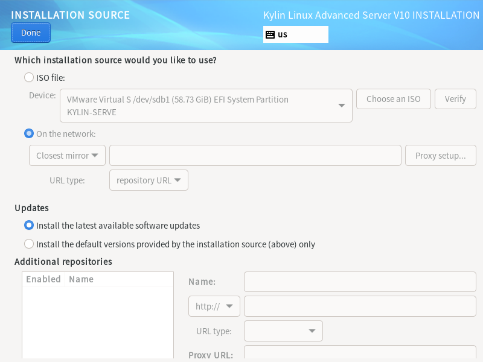
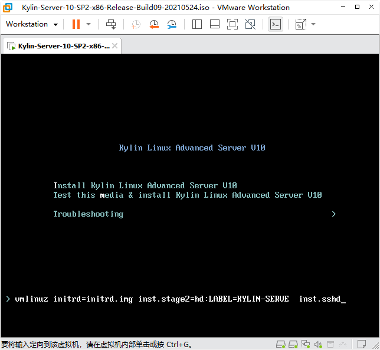
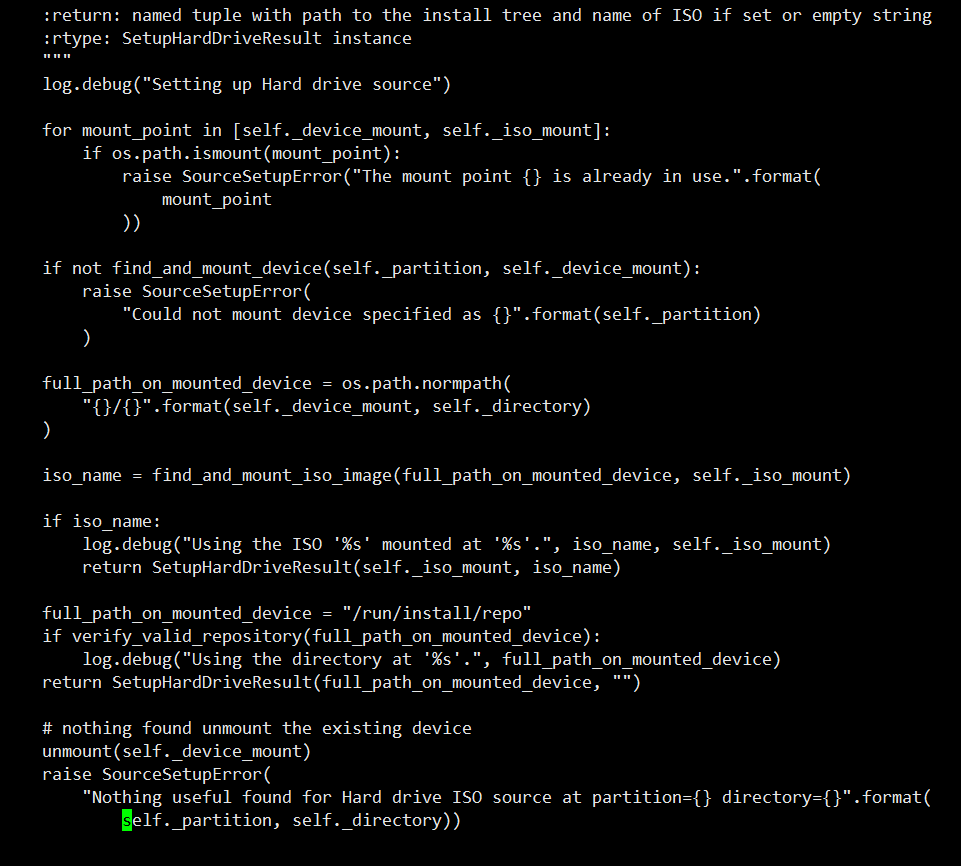
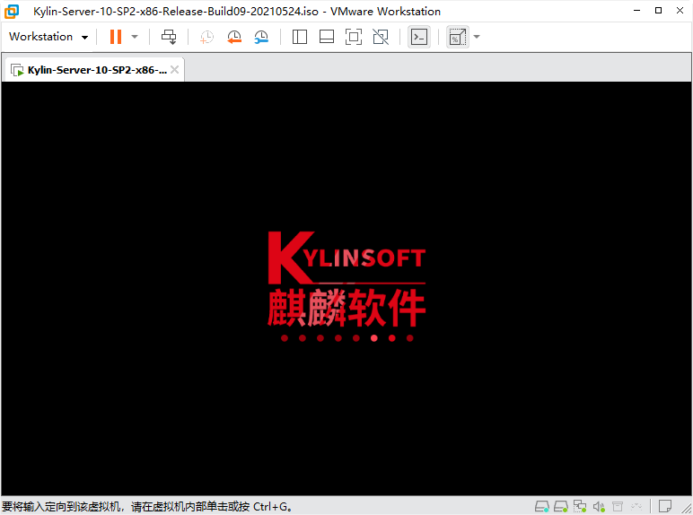

<!-- MDTOC maxdepth:6 firsth1:1 numbering:0 flatten:0 bullets:1 updateOnSave:1 -->

- [Kylin-Server-10-SP2U盘启动引导问题](#kylin-server-10-sp2u盘启动引导问题)   
   - [环境搭建](#环境搭建)   
   - [问题复现](#问题复现)   
   - [启用sshd服务](#启用sshd服务)   
   - [日志检索](#日志检索)   
   - [修复方案](#修复方案)   
   - [杂项](#杂项)   

<!-- /MDTOC -->

# Kylin-Server-10-SP2U盘启动引导问题


## 环境搭建

* VMware**®** Workstation 16 Pro
* **64G** U盘一个
* Rufus
* ISO镜像（**Kylin-Server-10-SP2-x86-Release-Build09-20210524.iso**）

```
Kylin-Server-10-SP2-x86-Release-Build09-20210524.iso
文件大小：4345683968 字节
修改时间：2022年8月23日 20:16:09
MD5     ：52F618CBBBFE0FDC08AA4719FF86E1BB
SHA1    ：8E3A0FD30A1C9F3945D636BC0959DC8164E2201D
CRC32   ：25EAC58D
```

下载地址:

1. <https://archive.org/details/kylin-server-10-sp-2-x-86-release-build-09-20210524>
2. <https://pan.baidu.com/s/19CmmJWl0jDzUTJxEcJZ3Tg> **网盘提取码：now7**


## 问题复现


使用Rufus烧写 Kylin-Server-10-SP2-x86-Release-Build09-20210524.iso


**管理员权限运行VMware**，必须用管理员权限


这里，若不是管理员权限，看不到U盘，权限要给够


确定容量是U盘容量大小


调整启动顺序，第二块硬盘作为第一启动项即可


F10保存重启，进入U盘启动


想要创建快照，可惜了，具有物理盘的虚机无法创建快照。


anaconda 33.19-15.p20.ky10


当看到这里的时候，毫无疑问，装不下去了


安装源找不到。理论上，应该显示U盘是安装源，但这里却让用户通过ISO文件、网络选择可用的安装源。为什么U盘安装源被隐藏了呢？



下一步该干啥？日志，毫无疑问

小技巧，anaconda底层是个python，前端使用tmux托管，用过tmux的都知道它的特点，伪终端、伪屏幕，进程托管后台运行


* ```CTRL + ALT + 2```进入shell终端
* 图形界面在第六屏幕，```CTRL + ALT + 6```可以切换回去


anaconda日志都在/tmp目录下

* X.log : Xorg日志
* anaconda.log : anaconda主进程日志
* dbus : dbus消息通道daemon日志
* storage.log : 所有存储设备相关日志
* program.log : 配置过程、安装进度相关日志
* lvm.log : 逻辑卷相关日志

上面那个问题，找不到源，多半是在storage.log里面

## 启用sshd服务

* <https://anaconda-installer.readthedocs.io/en/latest/boot-options.html?highlight=ssh#inst-sshd>




GRUB启动菜单界面下按TAB进行修改，移除quiet，增加 ```inst.sshd```


默认没有启用dhcp client，都没有ip还怎么个sshd，所以手动dhclient一下


ssh直接root用户登录，无需密码（这点很花哨）


## 日志检索


sda是物理盘 500G， sdb是 U盘


grep一下，lvm.log没看到有用信息


## 修复方案


* 参看 <https://gitee.com/src-openeuler/anaconda/pulls/127#note_12550620>


---


## 杂项


```

==> anaconda.log <==
06:47:00,037 DBG payload.manager: Restarting payload thread
06:47:00,038 INF threading: Running Thread: AnaPayloadRestartThread (139663990900480)
06:47:00,038 DBG ui.common: Left spoke: SourceSpoke
06:47:00,038 INF threading: Running Thread: AnaPayloadThread (139663982507776)
06:47:00,039 INF threading: Thread Done: AnaPayloadRestartThread (139663990900480)
06:47:00,039 DBG payload.manager: Updating payload thread state: STARTED
06:47:00,074 DBG ui.gui.hubs: spoke is not ready: SoftwareSelectionSpoke
06:47:00,075 DBG ui.gui.hubs: spoke is not ready: SourceSpoke
06:47:00,075 DBG ui.gui.hubs: setting SourceSpoke status to: 正在设置安装源...
06:47:01,043 DBG payload.manager: Updating payload thread state: WAITING_STORAGE
06:47:01,045 DBG payload.manager: Updating payload thread state: WAITING_NETWORK
06:47:01,045 DBG payload.manager: Updating payload thread state: DOWNLOADING_PKG_METADATA

==> packaging.log <==
06:47:01,046 INF packaging: Configuring the base repo

==> anaconda.log <==
06:47:01,090 DBG ui.gui.hubs: setting SourceSpoke status to: 正在探测存储......
06:47:01,090 DBG ui.gui.hubs: setting SourceSpoke status to: 正在下载软件包元数据......
06:47:01,091 DBG ui.gui.hubs: setting SoftwareSelectionSpoke status to: 正在下载软件包元数据......
06:47:03,070 ERR payload.manager: PayloadError: Nothing useful found for Hard drive ISO source at partition=LABEL=KYLIN-SERVE directory=
06:47:03,070 DBG payload.manager: Updating payload thread state: ERROR

==> packaging.log <==
06:47:03,071 DDEBUG dnf: Cleaning up.
06:47:03,071 DBG dnf: User-Agent: constructed: 'libdnf (Kylin Linux Advanced Server V10; generic; Linux.x86_64)'
06:47:03,073 ERR packaging: PLATFORM_ID missing from /etc/os-release
06:47:03,073 DBG packaging: getting release version from tree at None (rawhide)
06:47:03,073 DBG packaging: using default release version of rawhide
06:47:03,077 DDEBUG dnf: Getting group metadata
06:47:03,078 DDEBUG dnf: timer: loading comps: 0 ms

==> dnf.librepo.log <==
2022-08-31T22:47:03Z INFO Librepo version: 1.12.0 with CURL_GLOBAL_ACK_EINTR support (libcurl/7.71.1 OpenSSL/1.1.1f-fips zlib/1.2.11 brotli/1.0.7 libidn2/2.3.0 libpsl/0.21.1 (+libidn2/2.0.5) libssh/0.9.4/openssl/zlib nghttp2/1.41.0)

==> packaging.log <==
06:47:03,079 DBG packaging: Dnf configuration:
[main]
assumeno = 0
assumeyes = 0
autocheck_running_kernel = 1
bandwidth = 0
best = 0
bugtracker_url = https://bugzilla.redhat.com/enter_bug.cgi?product=Fedora&component=dnf
cachedir = /tmp/dnf.cache
cacheonly = 0
check_config_file_age = 1
clean_requirements_on_remove = 1
color = auto
color_list_available_downgrade = magenta
color_list_available_install = bold,cyan
color_list_available_reinstall = bold,underline,green
color_list_available_upgrade = bold,blue
color_list_installed_extra = bold,red
color_list_installed_newer = bold,yellow
color_list_installed_older = yellow
color_list_installed_reinstall = cyan
color_search_match = bold,magenta
color_update_installed = red
color_update_local = green
color_update_remote = bold,green
config_file_path = /etc/dnf/dnf.conf
countme = 0
debug_solver = 0
debuglevel = 2
defaultyes = 0
deltarpm = 1
deltarpm_percentage = 75
disable_excludes =
diskspacecheck = 1
enabled = 1
enablegroups = 1
errorlevel = 3
exclude =
excludepkgs =
exit_on_lock = 0
fastestmirror = 0
gpgcheck = 0
gpgkey_dns_verification = 0
group_package_types = mandatory, default, conditional
history_list_view = commands
history_record = 1
history_record_packages = dnf, rpm
ignorearch = 0
includepkgs =
install_weak_deps = 1
installonly_limit = 3
installonlypkgs = kernel, kernel-PAE, installonlypkg(kernel), installonlypkg(kernel-module), installonlypkg(vm), multiversion(kernel)
installroot = /mnt/sysroot
ip_resolve = whatever
keepcache = 0
localpkg_gpgcheck = 0
log_rotate = 4
log_size = 1048576
logdir = /tmp/
max_parallel_downloads = 3
metadata_expire = 172800
metadata_timer_sync = 10800
minrate = 1000
multilib_policy = best
obsoletes = 1
password =
persistdir = /mnt/sysroot/var/lib/dnf
pluginconfpath = /tmp/dnf.pluginconf
pluginpath = /usr/lib/python3.7/site-packages/dnf-plugins
plugins = 1
protected_packages = dnf, systemd, systemd-udev, dnf
proxy =
proxy_auth_method = any
recent = 7
repo_gpgcheck = 0
reposdir = /etc/yum.repos.d, /etc/anaconda.repos.d, /tmp/updates/anaconda.repos.d, /tmp/product/anaconda.repos.d
reset_nice = 1
retries = 10
rpmverbosity = info
showdupesfromrepos = 0
skip_broken = 0
skip_if_unavailable = 0
sslcacert =
sslclientcert =
sslclientkey =
sslverify = 1
strict = 1
system_cachedir = /var/cache/dnf
throttle = 0
timeout = 30
transformdb = 1
tsflags =
upgrade_group_objects_upgrade = 1
user_agent = libdnf (Kylin Linux Advanced Server V10; generic; Linux.x86_64)
username =
varsdir = /etc/yum/vars, /etc/dnf/vars
zchunk = 1


==> anaconda.log <==
06:47:03,131 DBG ui.gui.hubs: setting SourceSpoke status to: 设置安装源失败
06:47:03,133 DBG ui.gui.hubs: spoke is ready: SourceSpoke
06:47:03,133 DBG ui.gui.hubs: setting SoftwareSelectionSpoke status to: 设置安装源失败
06:47:04,095 INF threading: Thread Done: AnaPayloadThread (139663982507776)

```








---
